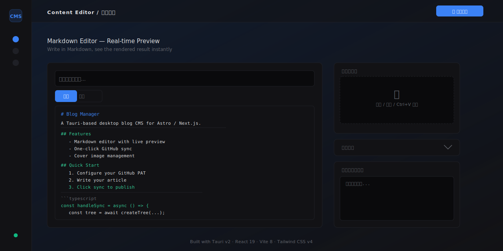

# Blog Manager

> A Tauri-based desktop app for managing blog content with Markdown editing, cover image management, and one-click GitHub sync — designed for Astro / Next.js static blogs.

<p align="center">
  
</p>

<p align="center">
  
  
  
  
  
</p>

---

## Features

| Feature | Description |
|---|---|
| **Markdown Editor** | Dual edit/preview mode with real-time rendering |
| **Frontmatter Metadata** | Title, author, categories, tags, description, publish date — auto-generated YAML |
| **Cover Image** | Upload by click, drag & drop, or Ctrl+V paste from clipboard |
| **Auto-save Draft** | Auto-saves to browser 2s after input, recoverable on next launch |
| **One-Click GitHub Sync** | Tree-based commit via Git Data API — no local Git setup required |
| **Double Confirmation** | Review dialog with details + checkbox before publishing |
| **Progress Steps** | Visual progress bar during sync with step-by-step logs |
| **Publish History** | Every successful sync recorded; view and manage past articles |
| **Connection Test** | Verify GitHub token and repo config from settings panel |
| **Keyboard Shortcuts** | Ctrl+S save, Ctrl+Shift+P toggle preview, press `?` for full list |
| **Unsaved Warning** | Browser prompts on close if content hasn't been saved |

---

## Quick Start

### 1. Configure GitHub Credentials

Click the **⚙️ Settings** tab in the left sidebar, then fill in:

- **Personal Access Token (PAT)** — GitHub PAT with `repo` or `contents` write permission
- **Repository Path** — `username/repo` pointing to your blog repo
- **Target Branch** — default `main`

Click **🔌 Test Connection** to verify.

### 2. Write an Article

Switch to the **✍️ Editor** tab:

1. Enter a title
2. Write content in Markdown
3. (Optional) Upload a cover image — click, drag & drop, or Ctrl+V paste
4. (Optional) Expand the **Advanced** panel to set author, category, tags, etc.

Content auto-saves to your browser; close and reopen to recover.

### 3. Publish

Click **🚀 Sync** (or press `Ctrl+S` to save draft first), then:

1. Review the confirmation dialog (title, author, target repo)
2. Check the confirmation box → click **Confirm**
3. Watch the progress bar and real-time logs during sync
4. Once complete, click **New Article** to continue writing

### 4. Manage Published Articles

Switch to the **📋 Manage** tab to browse all published articles — title, filename, publish time, and more.

---

## Keyboard Shortcuts

| Shortcut | Action |
|---|---|
| `Ctrl + S` | Save draft |
| `Ctrl + Shift + P` | Toggle edit / preview mode |
| `Ctrl + Shift + I` | Open cover image picker |
| `Ctrl + V` | Paste clipboard image as cover |
| `?` or `Ctrl + /` | Open shortcut help panel |

---

## Tech Stack

| Layer | Technology |
|---|---|
| Desktop Framework | Tauri v2 (Rust) |
| Frontend | React 19 + TypeScript |
| Build Tool | Vite 8 |
| Styling | Tailwind CSS v4 |
| Backend | GitHub Git Data API (tree-based commit) |

---

## Development

```bash
# Install dependencies
npm install

# Start dev server (frontend only)
npm run dev

# Start Tauri desktop app
npm run tauri dev

# Build for production
npm run tauri build
```

## Project Structure

```
src/
├── App.tsx                      # Main layout + tab routing
├── main.tsx                     # Entry point
├── index.css                    # Tailwind styles
├── components/
│   ├── Editor.tsx               # Editor panel
│   ├── MarkdownPreview.tsx      # Markdown rendering
│   ├── FrontmatterEditor.tsx    # Metadata editor
│   ├── TagInput.tsx             # Chip-style tag input
│   ├── ConfirmDialog.tsx        # Publish confirmation dialog
│   ├── SettingsPanel.tsx        # Settings (connection test)
│   ├── ArticleManager.tsx       # Article management view
│   ├── PublishHistory.tsx       # History cards
│   └── ShortcutHelp.tsx         # Keyboard shortcut help
├── hooks/
│   └── useGitHubSync.ts         # Core state + GitHub API logic
└── types/
    └── github.ts                # TypeScript type definitions
```

---

## Data Security

- **Token** is stored in browser `localStorage` — never sent to third parties
- **Content** is written directly to your GitHub repo via API — no intermediate server
- **Drafts and history** are stored locally in browser — can be cleared anytime

---

## License

[MIT](LICENSE)

---

---

## 中文说明

# Blog Manager — 桌面端博客内容管理器

一款基于 Tauri 的桌面应用，提供 Markdown 编辑、封面图管理、一键同步到 GitHub 的能力，专为 Astro / Next.js 静态博客设计。

### 功能一览

| 功能 | 说明 |
|---|---|
| **Markdown 编辑器** | 编辑/预览双模式，实时渲染排版效果 |
| **Frontmatter 元数据** | 标题、作者、分类、标签、描述、发布日期，自定义写入 YAML |
| **封面图管理** | 点击上传 / 拖拽文件 / Ctrl+V 粘贴截图，三种方式 |
| **草稿自动保存** | 输入后 2 秒自动存入浏览器，下次打开可恢复 |
| **一键同步到 GitHub** | 通过 Git Data API 树状提交，无需本地 Git 环境 |
| **双重确认** | 发布前弹窗展示详情 + 勾选确认，防止误操作 |
| **分步进度条** | 同步过程可视化，显示当前步骤和进度 |
| **发布历史** | 每次成功同步自动记录，支持查看和管理 |
| **连接测试** | 设置面板可验证 Token 和仓库配置是否有效 |
| **快捷键** | Ctrl+S 保存、Ctrl+Shift+P 切换预览等，按 `?` 查看全部 |
| **未保存提醒** | 关闭窗口时如果内容未保存，浏览器会弹出确认 |

### 快速开始

#### 1. 配置 GitHub 凭证

点击左侧 **⚙️ 设置**，填写：

- **Personal Access Token (PAT)** — GitHub 个人访问令牌，需拥有 `repo` 或 `contents` 写入权限
- **GitHub 仓库路径** — 格式为 `用户名/仓库名`，指向你的博客仓库
- **目标分支** — 默认 `main`

填写后点击 **🔌 测试连接** 验证配置是否正确。

#### 2. 写文章

切换到 **✍️ 编辑器**：

1. 输入文章标题
2. 在正文区域用 Markdown 语法书写内容
3. （可选）上传封面图——点击、拖拽或 Ctrl+V 粘贴
4. （可选）展开右侧 **高级设置**，填写作者、分类、标签等信息

提示：内容会自动保存到浏览器，下次打开可恢复。

#### 3. 发布

点击 **🚀 一键同步** 或按 `Ctrl+S` 先保存草稿，然后：

1. 弹出发布确认窗，显示标题、作者、目标仓库等信息
2. **勾选确认框** → **点击确认发布**
3. 同步过程中顶部显示分步进度条和实时日志
4. 完成后右上角出现 **✅ 已发布**，可点击 **新建文章** 继续写

#### 4. 管理已发布文章

切换到 **📋 管理**，查看所有已发布文章的列表，包括标题、文件名、发布时间等信息。

### 技术栈

| 层级 | 技术 |
|---|---|
| 桌面框架 | Tauri v2 (Rust) |
| 前端框架 | React 19 + TypeScript |
| 构建工具 | Vite 8 |
| 样式方案 | Tailwind CSS v4 |
| 后端服务 | GitHub Git Data API (树状提交) |
